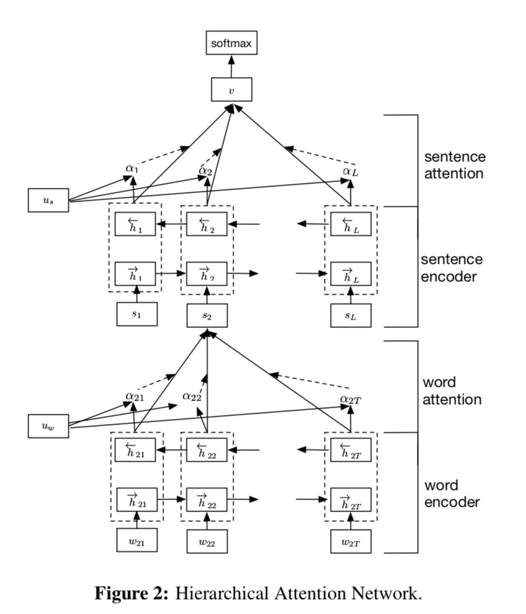

# Pytorch Implement of Hierarchical Attention Networks 

This project reproduces the Hierarchical Attention Networks proposed in NAACL 2016 "Hierarchical Attention Networks for Document Classification". 

Here is the link of the original paper(https://www.cs.cmu.edu/~diyiy/docs/naacl16.pdf)

## Overall of Model Structure

-   The structure of proposed model is shown as follow: 
    -   First Use word embedding layer to get the word sequence.
    -   Use Bi-GRU model to get contextual representation of the word.
    -   Use $u_w$ (a learnable model parameters served as attention Query.) & Attention model aggregate word information into sentences representation.
    -   Similarly Use Bi-GRU model to get contextual representation of the sentence. Then Use $u_s$ (a learnable model parameters served as attention Query.) & Attention model aggregate sentence information into document representation.
    -   Finally Use a linear layer served as as classifier.

## Result on CPU

Thanks to poutyne lib, I have saved lots of time on train codes & logics.

Now, I test the code on my own computer, It goes well for 2000 iterators. I will test it further when gpu is available.

-   Still, there is lots of things to do for a more perfect model. 
    -   First Attention on padding item can be set to 0
    -   Second We should to do something with original dataset, since the Reviews are skewed towards positive.
    -   Last but not Least, Use typing to make our code readable for others.

